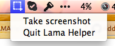
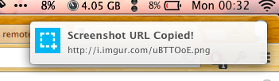

LAMAHelper
==========

OS X Application Helper for emre/lama

You can **[download](https://github.com/f/LAMAHelper/raw/master/build/LAMAHelper.app.zip)** the Application.

## Setting path to lama executable

If lama is installed somewhere else than `/usr/local/bin/lama` you can change
the path using the following command:

```bash
$ defaults write org.pyistanbul.LAMAHelper
```

## Screenshots





